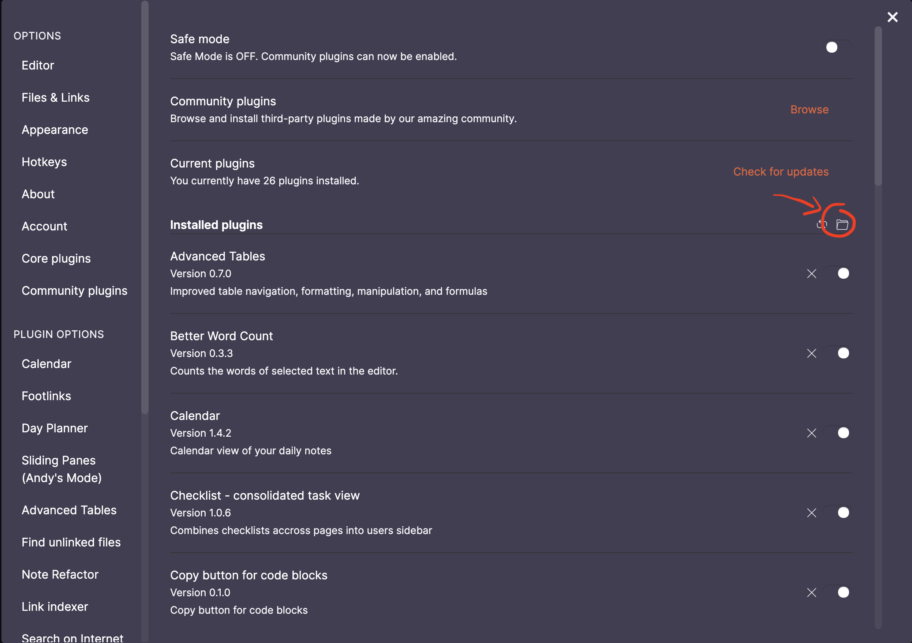

# symlinks-obsidian

A plugin that refreshes symlinks in an obsidian vault, allowing them to be used.

## Installation

Clone or copy the contents of this repo to the Obsidian plugins folder, found on the "Community Plugins" page:



```
cd {{ PLUGIN_FOLDER_PATH }}
git clone https://github.com/chrisdmacrae/symlinks-obsidian.git
```

> Replace `{{ PLUGIN_FOLDER_PATH }}` with the full path to the plugins folder.

Or head to the Obsidian third-party plugins section of the settings, browse "Community plugins", and install "Symlink Refresher".
